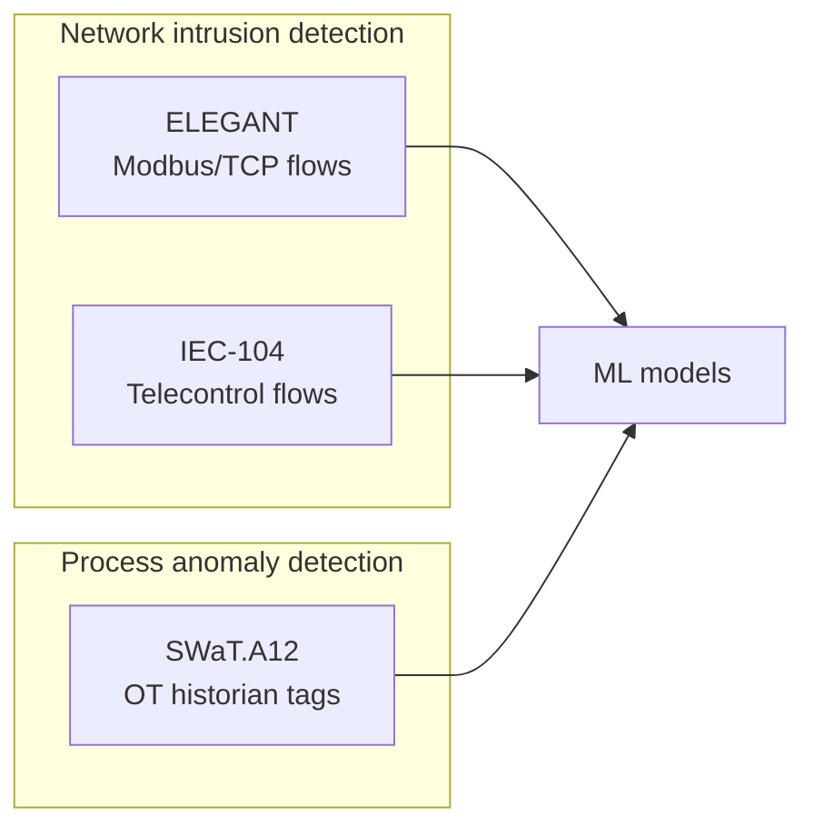
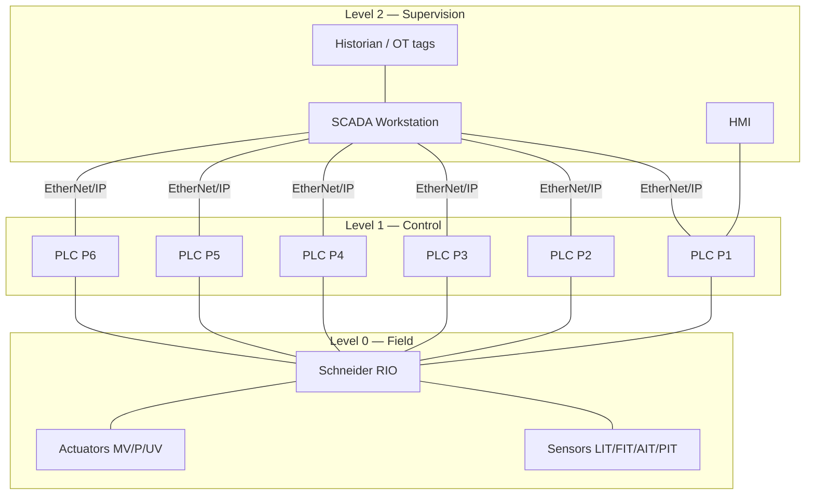
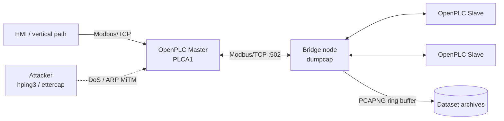
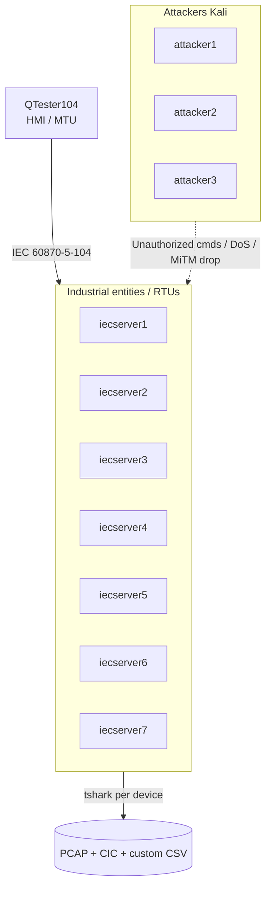
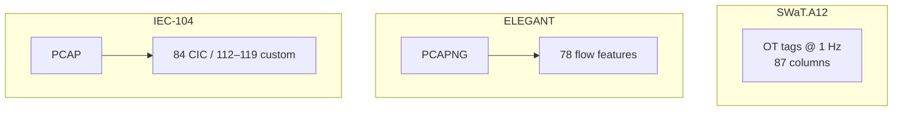
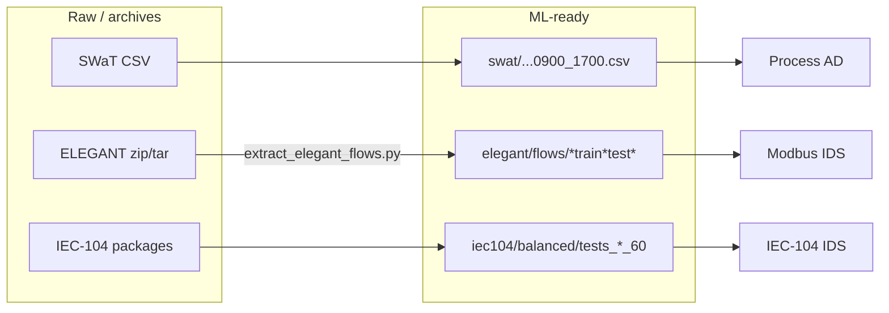

# AI-TDP Industrial Cybersecurity Datasets
## Architecture, Devices, Protocols & Data Documentation

**Document type:** Professional technical reference  
**Project:** AI-TDP  
**Date:** 2026-07-16  
**Scope:** Local datasets — SWaT.A12, ELEGANT (PLC DoS/MiTM), IEC 60870-5-104  

---

## Document control

| Item | Detail |
| :--- | :--- |
| Purpose | Single reference for testbed architecture, devices, protocols, data modalities, and ML use |
| Audience | Researchers, engineers, project stakeholders |
| Related files | `data/README.md`, `reports/TRAINING_EXPLAINER.md`, `reports/Local_Dataset_Feature_Inventory.docx` |
| Diagrams | `reports/diagrams/*.png` |

---

## 1. Executive overview

AI-TDP currently holds **three complementary industrial cybersecurity datasets**. They differ by physical fidelity, protocol stack, and ML modality:

| Dataset | Lab / origin | Fidelity | Primary protocol | Data modality | Primary ML use |
| :--- | :--- | :--- | :--- | :--- | :--- |
| **SWaT.A12** | iTrust, SUTD (Singapore) | Real scaled water plant | EtherNet/IP | OT process historian (CSV) | Unsupervised process anomaly detection |
| **ELEGANT** | CISUC, Univ. Coimbra / Fed4Fire+ | Soft-PLC lab | Modbus/TCP | PCAP → flow CSV | Supervised Modbus IDS (DoS/MiTM) |
| **IEC 60870-5-104** | ITHACA, UOWM (ELECTRON / SDN-microSENSE) | Emulated + some real RTUs | IEC-104 | PCAP + CIC/custom flow CSV | Supervised protocol IDS |



**Design principle:** do **not** merge the three datasets into one feature matrix. Train network IDS and process AD as separate tracks.

---

## 2. SWaT — Secure Water Treatment (A12 OT Dataset)

### 2.1 Purpose and origin

SWaT is a **high-fidelity, industry-compliant** water treatment testbed at iTrust (SUTD), funded originally with Singapore MINDEF / PUB guidance. It supports ICS security research: attack impact, detection, defence, and cascading failures.

**Local version:** `SWaT.A12_OTDataset_Mar_26`  
**Local file:** `data/swat/SWaT.A12_OTDataset_Mar_26/11-Mar-2026_0900_1700.csv`  
**Window:** 11 Mar 2026, 09:00:00–17:00:59 (28,860 rows @ 1 Hz)

> This A12 export is a **recent OT historian dump**. Unlike classic Dec 2015 SWaT CSVs, it has **no `Normal/Attack` label column**.

### 2.2 Architecture diagram




### 2.3 Process stages (physical plant)

| Stage | Role | Typical tags in A12 CSV |
| :--- | :--- | :--- |
| **P1** | Raw water intake / storage | `LIT101`, `FIT101`, `MV101`, `P101`, `P102` |
| **P2** | Chemical dosing | `FIT201`, `AIT201–203`, `MV201`, `P201–P208`, level alarms |
| **P3** | Ultrafiltration | `LIT301`, `FIT301`, `DPIT301`, `AIT301–303`, `MV301–304`, `P301–302` |
| **P4** | UV dechlorination | `LIT401`, `FIT401`, `AIT401–402`, `P401–404`, `UV401` |
| **P5** | Reverse osmosis | `FIT501–504`, `AIT501–504`, `PIT501–503`, `P501–502` (+ speeds), `MV501–504` |
| **P6** | Backwash / recycle storage | `LIT601–602`, `FIT601–602`, `P601–603`, level alarms |

Water flows **P1 → P2 → P3 → P4 → P5**, with **P6** supporting UF cleaning / storage loops.

### 2.4 Devices and software

| Layer | Devices / products |
| :--- | :--- |
| Controllers | **Allen-Bradley PLCs** (ControlLogix / CompactLogix class; typically one PLC domain per stage, often with redundancy) |
| Field I/O | **Schneider Electric Remote I/O (RIO)** wired to sensors/actuators |
| Operator | **HMI** + **SCADA** workstation (manual override of PLC logic possible) |
| Storage | **Historian** (process tags; PI-style naming in literature) |
| Network model | Purdue ICS layers; star / DLR topologies described in SWaT literature |

### 2.5 Protocols

| Protocol | Role |
| :--- | :--- |
| **EtherNet/IP (CIP)** | Primary PLC ↔ SCADA / HMI communications |
| Fieldbus / RIO links | Sensor/actuator I/O to PLCs (wired; wireless variants exist in some SWaT configs) |

**Note:** The local A12 file is **not** network PCAP; it is **historian OT telemetry**.

### 2.6 Type of data (local)

| Property | Value |
| :--- | :--- |
| Format | CSV |
| Sampling | 1 Hz |
| Columns | **87** |
| Categories | Timestamp (1), stage states (6), sensor `.Pv` (31), actuator `.Status` (32), alarms (15), pump speeds (2) |
| Labels | **None** (no attack column) |
| Quality notes | Some alarms entirely `Bad Input` (`PSH301`, `DPSH301`, `PSH501`, `PSL501`) — drop before ML |

### 2.7 Recommended ML use

- Unsupervised anomaly detection (Isolation Forest, autoencoder)  
- Multivariate forecasting + residual thresholding  
- Time-based train/test split (never random shuffle)

---

## 3. ELEGANT — DoS & MiTM on PLCs

### 3.1 Purpose and origin

Outcome of the **ELEGANT** project (Fed4Fire+ Open Call), University of Coimbra (CISUC). Public dataset on IEEE DataPort (DOI [10.21227/mewp-g646](https://doi.org/10.21227/mewp-g646)); documentation [arXiv:2103.09380](https://arxiv.org/abs/2103.09380).

Goal: labelled (via in-band markers) Modbus/TCP traces under **flooding**, **amplification**, and **ARP MiTM** (poisoning and full-chain register rewrite).

### 3.2 Architecture diagram




### 3.3 Infrastructure setup

| Element | Detail |
| :--- | :--- |
| Testbeds | **Fed4Fire+** — Virtual Wall2 and Grid5000 |
| PLC software | **OpenPLC v3** on all PLC nodes |
| Topology | Horizontal PLC–PLC + vertical PLC–HMI |
| Polling | Master polls slaves ~**100 ms** (reference Modbus rate ~25 pkt/s used for attack scaling) |
| Process logic | Simulated **tank level** + **pump (SWITCH)** threshold control |
| Capture | **Bridge** node on data plane with **dumpcap** (10–20 MB ring files) |
| Attack timing | UDP marker packets (`ATTACK__START__…`, `__MiTM_ATTACK_…`) |

### 3.4 Devices / roles

| Role | Implementation |
| :--- | :--- |
| PLC Master (PLCA1) | OpenPLC v3 — primary DoS target |
| PLC Slaves | OpenPLC v3 — holding registers with sensor values |
| Bridge / capture | Dumpcap on data interfaces |
| DoS attacker | **hping3** (TCP flood to :502 ~120 B; UDP amp ~60 B; `--rand-source`) |
| MiTM attacker | **ettercap** (`-M arp`; optional `-F` filter for Modbus rewrite) |

### 3.5 Protocols

| Protocol | Role |
| :--- | :--- |
| **Modbus/TCP** | Process control (port **502**) |
| ARP | Exploited for MiTM |
| UDP markers | Attack window labelling |

### 3.6 Type of data (local)

| Layer | Location | Content |
| :--- | :--- | :--- |
| Raw | `data/elegant/IEEE_DataPort/` | zip/tar PCAPNG archives |
| Intermediate | `data/elegant/work_pcaps/` | Unpacked `cap_*` |
| ML-ready | `data/elegant/flows/` | Flow CSVs (**78** features) |

| ML file | Rows (approx.) | Notes |
| :--- | ---: | :--- |
| `elegant_flows_all.csv` | 336,699 | Full extracted set |
| `elegant_flows_balanced.csv` | 15,097 | Undersampled DoS |
| `elegant_flows_train.csv` | 12,077 | Stratified 80% |
| `elegant_flows_test.csv` | 3,020 | Stratified 20% |

**Labels:** `normal`, `dos_flood`, `dos_amp`, `mitm_arp`, `mitm_full_chain`

### 3.7 Recommended ML use

Supervised multiclass IDS on train/test CSVs; drop identity columns; expect scarce MiTM samples.

---

## 4. IEC 60870-5-104 Intrusion Detection Dataset

### 4.1 Purpose and origin

Built for AI-based IDS on **IEC 60870-5-104** (telecontrol / grid-style). Created in H2020 **ELECTRON** and **SDN-microSENSE** contexts by Radoglou-Grammatikis et al. (ITHACA / UOWM). Zenodo: [7108614](https://zenodo.org/records/7108614).

### 4.2 Architecture diagram




### 4.3 Infrastructure setup

| Element | Detail |
| :--- | :--- |
| Industrial entities | **7** — **IEC TestServer** RTUs (literature: 5 virtual + 2 real RTUs) |
| HMI / MTU | **QTester104** — legitimate IEC-104 master commands |
| Attackers | **3× Kali Linux** with Metasploit, **OpenMUC j60870**, **Ettercap** |
| Capture | **tshark** per entity/device |
| Feature tools | **CICFlowMeter** + custom IEC-104 Python/Scapy parser |
| Attack classes | Unauthorized commands + DoS floods (+ MiTM drop package) |

### 4.4 Devices mapped to local folders

| Local folder pattern | Device role |
| :--- | :--- |
| `…_iecserver1` … `…_iecserver7` | RTU / industrial entity |
| `…_qtester` | HMI / MTU |
| `…_attacker1` … `…_attacker3` | Malicious insider hosts |

### 4.5 Protocols

| Protocol | Role |
| :--- | :--- |
| **IEC 60870-5-104** | Telecontrol ASDUs (TypeID, COT, I/S/U frames) |
| TCP/IP | Transport; CICFlowMeter features |
| ARP / MiTM tools | Packet drop / interception scenarios |

### 4.6 Type of data (local)

| Path | Content |
| :--- | :--- |
| `data/iec104/balanced/` | ML-ready balanced train/test (timeouts 15–180 s) |
| Attack packages | Per-entity PCAP + CIC + custom CSV (`m_sp_na_1_DoS`, `c_rd_na_1`, `mitm_drop`) |
| `ReadMe.pdf` | Official documentation |

| Feature family | Columns | Notes |
| :--- | ---: | :--- |
| CICFlowMeter | **84** | Generic TCP/IP flows + Label |
| Custom IEC-104 (balanced) | **112** | Protocol-aware (no IP identity) |
| Custom IEC-104 (per-entity) | **119** | Adds flow id / IPs / ports / start time |

**Balanced labels (12):** `NORMAL` + unauthorized / DoS variants of `c_ci_na_1`, `c_rd_na_1`, `c_rp_na_1`, `c_sc_na_1`, `c_se_na_1`, `m_sp_na_1_DoS`  
**Extra package label:** `mitm_drop` (CIC only in local package)

### 4.7 Recommended ML use

Supervised multiclass IDS — start with `tests_custom_60` or `tests_cic_60` train/test CSVs.

---

## 5. Cross-dataset comparison

### 5.1 Architecture & fidelity

| Dimension | SWaT.A12 | ELEGANT | IEC-104 |
| :--- | :--- | :--- | :--- |
| Physical process | Real water plant | Simulated tank logic | Emulated telecontrol |
| Controllers | Allen-Bradley PLCs | OpenPLC v3 | IEC TestServer RTUs |
| Operator UI | SCADA / HMI | PLC–HMI Modbus | QTester104 |
| Capture point | Historian | Bridge dumpcap | Per-device tshark |
| Attack tooling | N/A in local A12 CSV | hping3, ettercap | Metasploit, j60870, Ettercap |

### 5.2 Data modality comparison



### 5.3 ML track recommendation

| Track | Dataset | Model family | Target |
| :--- | :--- | :--- | :--- |
| A — Protocol IDS | IEC-104 custom/CIC | RF / XGBoost / NN | Multiclass Label |
| B — PLC IDS | ELEGANT flows | RF / XGBoost | Multiclass Label |
| C — Process AD | SWaT.A12 | Isolation Forest / AE / forecast | Anomaly score |

---

## 6. End-to-end data pipeline (local workspace)



| Stage | SWaT | ELEGANT | IEC-104 |
| :--- | :--- | :--- | :--- |
| Download | iTrust request | IEEE DataPort | Zenodo / IEEE |
| Local raw | Historian CSV | `IEEE_DataPort/` | Attack `.7z` + balanced |
| Feature ready | Same CSV | `flows/` | `balanced/` + entity CSVs |
| Train entrypoint | A12 CSV | `elegant_flows_train.csv` | `train_60_*.csv` |

---

## 7. Security relevance (threat coverage)

| Threat class | SWaT.A12 | ELEGANT | IEC-104 |
| :--- | :---: | :---: | :---: |
| Network DoS / flood | — | Yes | Yes |
| Amplification | — | Yes | — |
| ARP / MiTM | — | Yes | Yes (drop) |
| Unauthorized protocol commands | — | Modbus rewrite | Yes (ASDU injection) |
| Physical process anomaly | Yes (unlabeled) | Simulated only | — |

---

## 8. Citations (key references)

Full bibliography with IEEE, APA, BibTeX, and dataset DOIs: **[`reports/BIBLIOGRAPHY.md`](BIBLIOGRAPHY.md)**.

1. Mathur, A. P., & Tippenhauer, N. O. (2016). *SWaT: a water treatment testbed for research and training on ICS security.* CySWater. DOI: [10.1109/CySWater.2016.7469060](https://doi.org/10.1109/CySWater.2016.7469060)  
2. Goh, J., Adepu, S., Junejo, K. N., & Mathur, A. P. (2017). *A dataset to support research in the design of secure water treatment systems.* CRITIS 2016 (LNCS). DOI: [10.1007/978-3-319-71368-7_8](https://doi.org/10.1007/978-3-319-71368-7_8)  
3. Sousa, B., Cruz, T., Arieiro, M., & Pereira, V. (2021). *An ELEGANT dataset with Denial of Service and Man in The Middle attacks.* arXiv:2103.09380. Dataset DOI: [10.21227/mewp-g646](https://doi.org/10.21227/mewp-g646)  
4. Radoglou-Grammatikis et al. (2022). *Modeling, detecting, and mitigating threats against industrial healthcare systems.* IEEE Trans. Industrial Informatics. DOI: [10.1109/TII.2021.3093905](https://doi.org/10.1109/TII.2021.3093905). Dataset: [Zenodo 7108614](https://zenodo.org/records/7108614)  
5. iTrust SWaT lab pages — [SUTD](https://www.sutd.edu.sg/itrust/itrust-labs/datasets/dataset-characteristics/swat/)  

---

## 9. Glossary

| Term | Meaning |
| :--- | :--- |
| OT | Operational Technology — process control systems |
| Historian | Time-series store of process tags |
| PLC | Programmable Logic Controller |
| RTU | Remote Terminal Unit |
| MTU / HMI | Master Terminal Unit / Human–Machine Interface |
| ASDU | Application Service Data Unit (IEC-104) |
| COT / TypeID | Cause of Transmission / IEC-104 type identifier |
| CICFlowMeter | Tool extracting bidirectional TCP/IP flow features |
| Soft PLC | Software-emulated PLC (e.g. OpenPLC) |

---

## 10. Appendix — local path cheat sheet

```
data/
  swat/SWaT.A12_OTDataset_Mar_26/11-Mar-2026_0900_1700.csv
  elegant/flows/elegant_flows_train.csv
  elegant/flows/elegant_flows_test.csv
  iec104/balanced/.../tests_custom_60/train_60_custom_script.csv
  iec104/balanced/.../tests_custom_60/test_60_custom_script.csv

reports/
  diagrams/swat_architecture.png
  diagrams/elegant_architecture.png
  diagrams/iec104_architecture.png
  PROFESSIONAL_DATASET_DOCUMENTATION.md   ← this file
```

---

*End of document — AI-TDP professional dataset architecture & data reference.*
