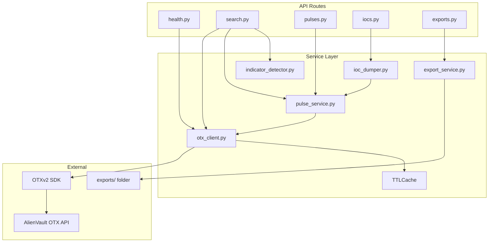

# OTX Threat Intelligence Workbench — Backend

FastAPI service that connects to the [AlienVault OTX](https://otx.alienvault.com) REST API via the official `OTXv2` Python SDK. It exposes a clean REST layer for the React frontend: health checks, global search, pulse inspection, IOC dumping, and file export.

---

## Architecture Overview

The backend follows a layered design: **routes → services → OTX client → AlienVault API**.



**Request flow (example: IOC dump)**

1. Frontend sends `POST /api/iocs/dump` with pulse IDs or a search query.
2. `iocs.py` validates the body with Pydantic (`IOCDumpRequest`).
3. `IOCDumperService` resolves pulses, fetches indicators per pulse, merges and deduplicates.
4. `OTXClient` calls OTX through the SDK (with caching and retries).
5. Response is serialized as `IOCDumpResponse` and returned as JSON.

---

## Project Structure

```
backend/
├── app/
│   ├── main.py                 # FastAPI app entry point, CORS, lifespan
│   ├── config.py               # Environment settings (Pydantic)
│   ├── dependencies.py         # FastAPI dependency injection
│   │
│   ├── api/routes/             # HTTP endpoints (thin controllers)
│   │   ├── health.py           # GET /api/health
│   │   ├── search.py           # GET /api/search
│   │   ├── pulses.py           # Pulse search, detail, indicators
│   │   ├── iocs.py             # POST /api/iocs/dump
│   │   └── exports.py          # Export generation + download
│   │
│   ├── core/                   # Cross-cutting concerns
│   │   ├── exceptions.py       # OTX errors → HTTP status codes
│   │   └── logging.py          # Structured log format
│   │
│   ├── models/
│   │   └── schemas.py          # Pydantic request/response models
│   │
│   └── services/               # Business logic
│       ├── otx_client.py       # OTX SDK wrapper + cache + retries
│       ├── pulse_service.py    # Pulse normalization and queries
│       ├── indicator_detector.py  # Auto-detect search input type
│       ├── ioc_dumper.py       # Merge, dedupe, filter IOCs
│       ├── export_service.py   # CSV / JSON / Excel generation
│       └── cache.py            # In-memory TTL cache
│
├── exports/                    # Generated export files (ephemeral)
├── requirements.txt
├── .env                        # Secrets (not committed)
└── README.md                   # This file
```

---

## Components

### `app/main.py` — Application Entry Point

- Creates the FastAPI application.
- Registers CORS middleware (allows the React dev server by default).
- Mounts all API routers.
- **Lifespan hook**: on startup, runs `ExportService.cleanup_old_exports()` to remove export files older than `EXPORT_RETENTION_HOURS`.

### `app/config.py` — Configuration

Loads settings from `backend/.env` using `pydantic-settings`. Cached via `@lru_cache` so settings are read once per process.

| Variable | Default | Purpose |
|---|---|---|
| `OTX_API_KEY` | *(required)* | AlienVault OTX API key |
| `OTX_SERVER` | `https://otx.alienvault.com` | OTX API base URL |
| `CACHE_TTL_SECONDS` | `600` | How long pulse/indicator responses stay in memory cache |
| `EXPORT_RETENTION_HOURS` | `24` | Max age of files in `exports/` before cleanup |
| `CORS_ORIGINS` | `http://localhost:5173` | Comma-separated allowed frontend origins |
| `DUMP_MAX_SEARCH_PULSES` | `25` | Max pulses resolved from a keyword dump (limits OTX fan-out) |

### `app/dependencies.py` — Dependency Injection

FastAPI `Depends()` providers used by route handlers:

| Function | Returns | Notes |
|---|---|---|
| `get_otx_client()` | `OTXClient` | Singleton per process (`@lru_cache`) |
| `get_pulse_service()` | `PulseService` | Wraps `OTXClient` |

Routes construct `IOCDumperService` and `ExportService` locally where needed.

---

## Core Layer (`app/core/`)

### `exceptions.py`

Maps OTX SDK exceptions to HTTP responses:

| Internal exception | HTTP status | When |
|---|---|---|
| `OTXInvalidApiKeyError` | 401 | Bad or missing API key |
| `OTXNotFoundError` | 404 | Pulse or indicator not found |
| `OTXBadRequestError` | 400 | Malformed request to OTX |
| Other / network | 502 | OTX unreachable or unexpected failure |

`to_http_exception()` is called in route `except` blocks for consistent error responses.

### `logging.py`

Configures Python logging with a structured format:

```
2026-07-07 19:31:43,917 | WARNING | urllib3.connectionpool | Connection pool is full...
```

---

## Models (`app/models/schemas.py`)

Pydantic models for request validation and OpenAPI documentation.

| Model | Used by | Purpose |
|---|---|---|
| `HealthResponse` | `GET /api/health` | Connection status, username, latency |
| `SearchResponse` | `GET /api/search` | Query, detected type, indicator details, matching pulses |
| `IOCDumpRequest` | `POST /api/iocs/dump` | Pulse IDs, search query, tags, type filter |
| `IOCRecord` | Dump + export | Single IOC with pulse metadata |
| `IOCDumpResponse` | `POST /api/iocs/dump` | IOC list, stats, pulses processed |
| `ExportRequest` | `POST /api/iocs/export` | IOCs, mode (`basic`/`extended`), format |
| `ExportResponse` | Export endpoints | Export ID, filename, download URL |

---

## Services (`app/services/`)

### `otx_client.py` — OTX SDK Wrapper

Central integration point with AlienVault OTX.

**Responsibilities:**

- Instantiates `OTXv2` with the API key from settings.
- Widens the HTTP connection pool to 20 (avoids urllib3 “pool is full” warnings during large dumps).
- Retries on 429 and 5xx with exponential backoff.
- Translates SDK exceptions into app-specific errors.
- Caches pulse details and indicator lists via `TTLCache`.

**Public methods:**

| Method | OTX SDK call | Cached? |
|---|---|---|
| `get_user_me()` | `GET /api/v1/users/me` | No |
| `search_pulses(query, max_results)` | `search_pulses()` | No |
| `get_pulse_details(pulse_id)` | `get_pulse_details()` | Yes |
| `get_pulse_indicators(pulse_id, limit)` | `get_pulse_indicators()` | Yes |
| `get_indicator_details_full(type, value)` | `get_indicator_details_full()` | No |

### `pulse_service.py` — Pulse Operations

Sits above `OTXClient` and normalizes OTX pulse payloads into a consistent shape for the API.

**`normalize_pulse()`** extracts:

- `id`, `name`, `description`, `author_name`, `created`, `modified`
- `tags`, `TLP`, `attack_ids`, `malware_families`, `references`
- `indicator_count`

**`PulseService` methods:**

- `search(query, limit)` — search pulses by keyword
- `get_details(pulse_id)` — single pulse metadata
- `get_indicators(pulse_id, limit)` — IOC list for a pulse

### `indicator_detector.py` — Input Type Detection

Used by global search to decide how to query OTX. Runs an ordered heuristic chain:

| Input pattern | Detected type | Strategy |
|---|---|---|
| Valid IPv4/IPv6 | `ip` | `indicator_details` |
| 32 hex chars | `md5` | `indicator_details` |
| 40 hex chars | `sha1` | `indicator_details` |
| 64 hex chars | `sha256` | `indicator_details` |
| `CVE-YYYY-NNNN` | `cve` | `indicator_details` |
| `http://` or `https://` | `url` | `indicator_details` |
| Email format | `email` | `pulse_search` |
| Domain hostname | `domain` | `indicator_details` |
| 24-char alphanumeric | `pulse_id` | `pulse_lookup` |
| Anything else | `keyword` | `pulse_search` |

Returns a `DetectionResult` dataclass: `input_value`, `detected_type`, `search_strategy`, and optional `indicator_type` (OTX SDK type object).

### `ioc_dumper.py` — IOC Dump Pipeline

Core workflow for bulk IOC extraction.

**Pipeline steps:**

1. **Resolve pulses** — from explicit `pulse_ids` and/or `search_query` (capped by `DUMP_MAX_SEARCH_PULSES`), with optional tag filtering.
2. **Fetch indicators** — for each pulse, call `get_pulse_indicators()`.
3. **Enrich** — attach pulse metadata (name, author, tags, TLP, MITRE IDs, etc.) to each IOC.
4. **Deduplicate** — key `(type, normalized_value)`; keep the record with richer references.
5. **Filter** — apply `type_filter` (`ip`, `domains`, `urls`, `file_hashes`, `cves`, `email_addresses`, `yara`, `all`).
6. **Stats** — count by type, total, unique.

**Filter map** (API `type_filter` → OTX indicator types):

| Filter | OTX types included |
|---|---|
| `ip` | IPv4, IPv6, CIDR |
| `domains` | domain, hostname |
| `urls` | URL, URI |
| `file_hashes` | FileHash-MD5, SHA1, SHA256 |
| `cves` | CVE |
| `email_addresses` | email |
| `yara` | YARA |
| `all` | No filter |

### `export_service.py` — File Export

Writes IOC data to `backend/exports/` as downloadable files.

**Export modes:**

| Mode | Columns |
|---|---|
| `basic` | IOC Type, IOC Value, Description |
| `extended` | Basic + Pulse Name, Author, Created Date, Tags, References, Malware Family, MITRE ATT&CK, TLP |

**Formats:** `csv`, `json`, `xlsx` (via `openpyxl`).

Each export gets a UUID filename (e.g. `a1b2c3d4-....csv`). `cleanup_old_exports()` deletes files older than the retention window.

### `cache.py` — TTL Memory Cache

Simple in-process cache: `get(key)` / `set(key, value)` with expiration based on `CACHE_TTL_SECONDS`. Used for pulse details and indicator lists to reduce repeated OTX calls during a session.

---

## API Routes (`app/api/routes/`)

Interactive docs: **http://localhost:8000/docs** (Swagger UI).

### Health — `health.py`

```
GET /api/health
```

Calls OTX `users/me` to verify the API key. Returns:

```json
{
  "status": "connected",
  "otx_user": "your_username",
  "latency_ms": 142.5
}
```

### Global Search — `search.py`

```
GET /api/search?q=<query>&limit=25
```

1. Runs `detect_input_type(q)`.
2. For IOC types: fetches indicator details + related pulses.
3. For pulse ID: loads that pulse directly.
4. For keywords: searches pulses.

### Pulses — `pulses.py`

| Method | Endpoint | Description |
|---|---|---|
| `GET` | `/api/pulses/search?q=&limit=` | Search pulses by keyword |
| `GET` | `/api/pulses/{pulse_id}` | Pulse metadata |
| `GET` | `/api/pulses/{pulse_id}/indicators?limit=` | Indicators in a pulse |

### IOC Dump — `iocs.py`

```
POST /api/iocs/dump
```

**Request body:**

```json
{
  "pulse_ids": ["6a47950711440db76d84e5de"],
  "search_query": "emotet",
  "tags": ["ransomware"],
  "type_filter": "all"
}
```

`pulse_ids` and `search_query` can be combined. Tag filter applies only to search results.

**Response:**

```json
{
  "iocs": [{ "type": "IPv4", "value": "1.2.3.4", "description": "...", ... }],
  "stats": { "by_type": { "IPv4": 12, "domain": 5 }, "total": 17, "unique": 17 },
  "pulses_processed": 3
}
```

### Exports — `exports.py`

```
POST /api/iocs/export
GET  /api/exports/{export_id}/download
```

**Export request:**

```json
{
  "iocs": [ ... ],
  "mode": "extended",
  "format": "csv"
}
```

Returns metadata including `download_url`. The download endpoint streams the file from `exports/`.

---

## Setup

### Prerequisites

- Python 3.10+
- AlienVault OTX account and API key

### Install

```bash
cd backend
python -m venv venv
venv\Scripts\activate          # Windows
# source venv/bin/activate       # macOS/Linux

pip install -r requirements.txt
```

### Configure

Create `backend/.env`:

```env
OTX_API_KEY=your_key_here
OTX_SERVER=https://otx.alienvault.com
CACHE_TTL_SECONDS=600
EXPORT_RETENTION_HOURS=24
CORS_ORIGINS=http://localhost:5173
DUMP_MAX_SEARCH_PULSES=25
```

Obtain an API key: [OTX](https://otx.alienvault.com) → Settings → API Integration.

### Run

```bash
uvicorn app.main:app --reload --port 8000
```

- API base: `http://localhost:8000`
- Swagger UI: `http://localhost:8000/docs`
- ReDoc: `http://localhost:8000/redoc`

---

## Error Handling

All route handlers follow the same pattern:

```python
try:
    result = service.do_something(...)
    return result
except Exception as exc:
    raise to_http_exception(exc)
```

The frontend should handle:

- **401** — Check `OTX_API_KEY` in `.env`
- **404** — Invalid pulse ID or indicator
- **502** — OTX down, rate-limited, or network issue (SDK retries 429/5xx automatically)

---

## Performance Notes

- **Caching**: Pulse details and indicators are cached in memory for `CACHE_TTL_SECONDS` (default 10 minutes).
- **Dump limits**: Keyword dumps resolve at most `DUMP_MAX_SEARCH_PULSES` pulses (default 25) to avoid long-running requests.
- **Connection pool**: HTTP pool size is 20 to handle concurrent OTX calls during dumps.
- **Export cleanup**: Old files in `exports/` are removed on app startup and based on `EXPORT_RETENTION_HOURS`.

For very large dumps, prefer selecting specific pulse IDs instead of broad keyword searches.

---

## Dependencies

| Package | Role |
|---|---|
| `fastapi` | Web framework and OpenAPI |
| `uvicorn` | ASGI server |
| `pydantic-settings` | `.env` configuration |
| `python-dotenv` | Env file loading |
| `OTXv2` | Official AlienVault OTX Python SDK |
| `openpyxl` | Excel (`.xlsx`) export |
| `httpx` | HTTP client (transitive / tooling) |

---

## Related Documentation

- Root project overview: [`../README.md`](../README.md)
- Frontend: [`../frontend/`](../frontend/)
- OTX API reference: https://otx.alienvault.com/api
